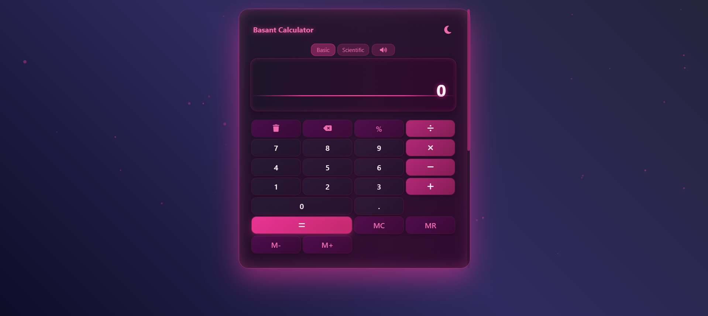
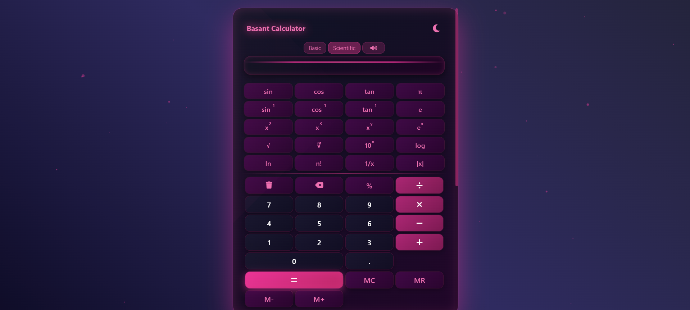

# Calculator

A simple and responsive calculator web application built using HTML, CSS, and JavaScript.



## Features

- Basic arithmetic operations: addition, subtraction, multiplication, and division
- Responsive design for desktop and mobile devices
- Clear and user-friendly interface

## Demo

Check out the live demo: [Calculator Live](https://basantkr762.github.io/Calculator/)

## Getting Started

### Clone the repository

```bash
git clone https://github.com/basantkr762/Calculator.git
```

### Open the Calculator

Just open the `index.html` file in your browser, or deploy it to your web server.

## Technologies Used

- HTML
- CSS
- JavaScript

## Contributing

Contributions are welcome! Please open an issue or submit a pull request for improvements or new features.

## License

This project is licensed under the MIT License.
